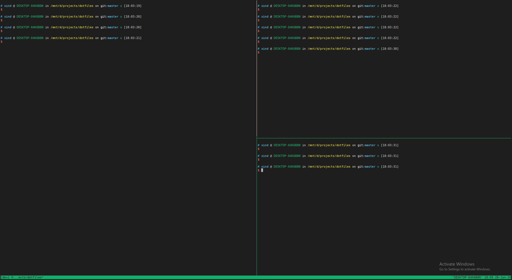

# dotfiles
Personal dotfiles for Linux.

# Installation
## Automatic
```
cd dotfiles
./install.sh
```

## Manually
### Zsh
On Ubuntu:
* Install zsh
```
sudo apt install zsh -y 
chsh -s /usr/bin/zsh
echo $SHELL #check if chsh works
```
* Install Oh-my-zsh
```
sudo apt install wget git -y
wget https://github.com/robbyrussell/oh-my-zsh/raw/master/tools/install.sh -O - | zsh
```
* Install plugins
```
# zsh-syntax-highlighting
git clone https://github.com/zsh-users/zsh-syntax-highlighting.git ${ZSH_CUSTOM:-~/.oh-my-zsh/custom}/plugins/zsh-syntax-highlighting
# zsh-autosuggestions
git clone https://github.com/zsh-users/zsh-autosuggestions.git $ZSH_CUSTOM/plugins/zsh-autosuggestions
```
* Install autojump
```
git clone https://github.com/wting/autojump.git
cd autojump
./install.py or ./uninstall.py
```
* Enable
```
cp */dotfiles/zsh/zshrc ~/.zshrc
source ~/.zshrc
```

### Tmux
On Ubuntu
```
cp */dotfiles/tmux/tmux.conf ~/.tmux.conf
```

### Vim
* Install vim-plug(Vim plugin manager)
```
curl -fLo ~/.vim/autoload/plug.vim --create-dirs \
    https://raw.githubusercontent.com/junegunn/vim-plug/master/plug.vim
```
* Config .vimrc
```
cp */dotfiles/vim/vimrc ~/.vimrc
```
* Install plugin
```
:PlugInstall
```

# Display

